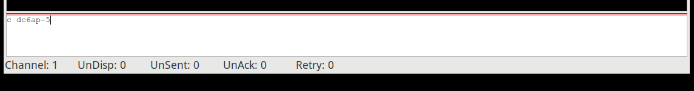
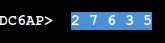
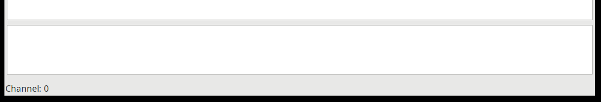
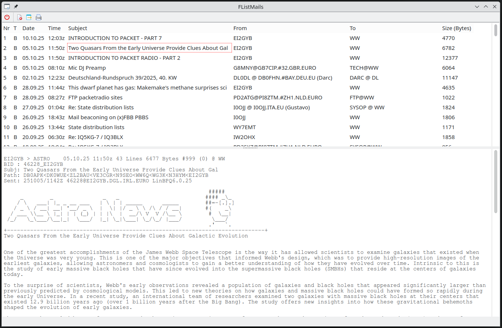
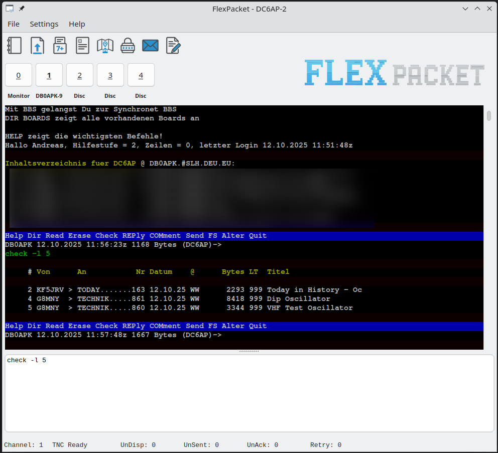
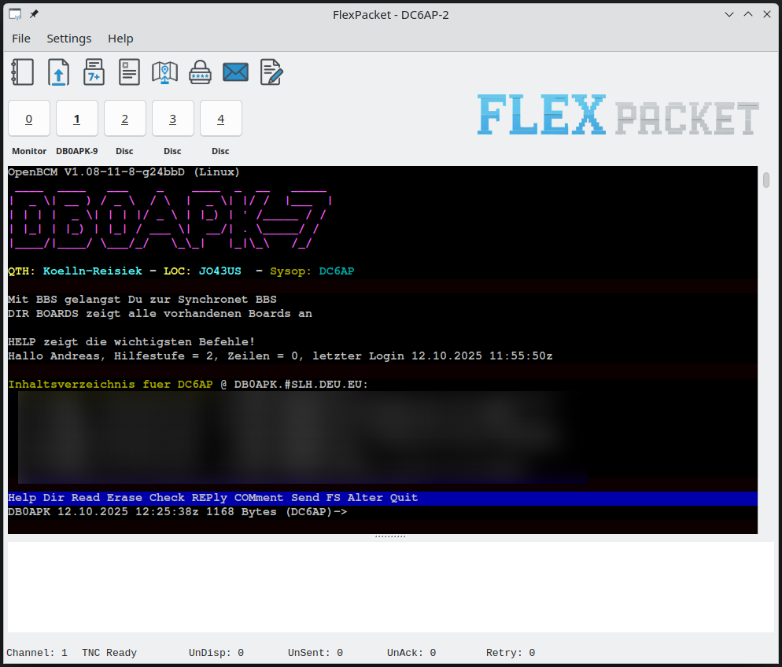
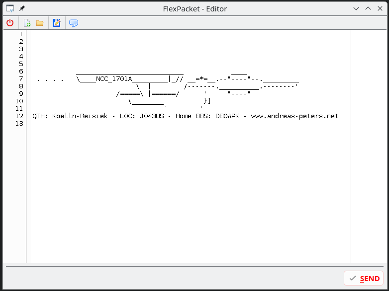

# Flexpacket - Packet Radio Client.

[](https://www.paypal.com/donate/?hosted_button_id=ZDB5ZSNJNK9XQ)

## Important Infos

I'm a Linux User! So, the main platform for FlexPacket are Linux based Systems
and not Windows. But I really do my best to support Windows. Sometimes I need
your help. As example, I have issues with Hostmode under Windows. But I cannot
find the problem. If someone use Windows on Hardware (not like me in a VM), I
would be happy to get feedback if Hostmode via USB/RS232 is working.

All the special BBS features, I can only test with OpenBCM and LinBPQ.

## Features

- Support for Hostmode TNC's (with TF2.x Firmware) 
- Support for KISS via TFKISS (external Software)
- Support for the AGW Protocol (Direwolf)
- Multichannel (only in Hostmode/TFKISS) 
- Addressbook for quick connections and BayCom password
- 7Plus generator
- 7Plus FileUp/Download (only in Hostmode) 
- Common ANSI color codes (in testing)
- APRS Map as external Software.
- Choose Terminal Font
- Autostore Mails for later reading (Details under How To Use).
- Multiline Message Editor
- Convers support in seperate window. Format and Colorizing support only for
  LinBPQ. For others, please send me User Joined, Left, and Chat messages as
  Screenshot. :-) Thanks.

## Planned Features

- Support forms to send simple structured information in an emergency case.

## Download

- You will find the current and all last releases for Windows and Linux [here](https://github.com/andreaspeters/flexpacket/releases)
- The newest builds created by the master branch, you will find [here](https://github.com/andreaspeters/flexpacket/actions). Open
  the last successfull build and scroll down to the artifacts.

## Requirements 

- Windows Users need the [sqlite3.dll](https://www.sqlite.org/download.html).
- [libqt6pas.so/dll](https://github.com/davidbannon/libqt6pas/releases)

### Optional

- Under `assets/font/437.ttf`you will find a font that is perfect for Terminal Windows.
  If you like, you can import it into your OperatingSystem and choose it in FlexPacket
  under `Terminalsettings`.

## How to compile

- Install Lazarus 3.6
- Install TRichMemo, LazSerial, CmdLine

## How to use

### How to connect with a station

In the command and message field (CMF), hit the `<ESC>` key to enter the command mode.
You will get visual feedback via a red line above CMF. Then type
`c <DESTINATION_CALL>` and then hit the Enter/Return key. At the same time,
you will exit the command mode.



### Baycom Password

To use the Baycom password functionality, add your baycom password into the 
Addressbook (be aware that it will be stored in playtext right now). 

If you connect to a BBS with enabled password, you will get a couple of numbers.



Now click at the  icon in the toolbar.


The BayCom password string will
be copied into the CMF. Press enter/return to send it.

### Change the Command Memo Field (CMF) size

If you want to change the size of the CMF, grab the gab with your Mouse.
The size will be stored in the configuration file.



### How to use KISS Mode

FlexPacket does not support KISS directly. TFKISS must be used for this. 
To use TFKISS, enable and configure it in the menu (Setting). For Linux
you can find TFKISS [here](https://github.com/andreaspeters/tfkiss). 
Windows Users can use [FlexNet](https://deltalima.org/prdownload/flexnet/).

Before someone ask! No I do not plan to implement KISS into FlexPacket. From
the development perspective KISS and specialy AX25 is very complicated. 
But FlexPacket should not be huge and complicated. I want to keep it as simple 
as possible for other Ham's to read, understand and Maintain the code.

### Autodownload Mails for later reading.

Some Mails are quite long and it needs time to download them through PacketRadio.
Flexpacket will save every Mail you opened automaticly therefore you can read it
whenever you want. Just open the Mail window in FlexPacket and you will find
all these mails. I test it with OpenBCM and I have no idea if it's working
for PBBS systems. Please gave me feedback.



## Shortcuts

- `ALT+0 to 9` Show Monitor or Channel 1 to 9
- `ALT+A` Open Addressbook
- `ALT+C` In the Addressbook, execute QuickCall at the current choosen Callsign
- `ALT+P` In the Addressbook, get the calculated BayCom password string
- `ALT+D` In the Addressbook, delete the current choosen Callsign
- `CTRL+SHIFT+P` Copy the extracted BayCom Password into the message window


## Wayland Support

QT6 hat issues with Window positioning under Wayland. The workaround would
be to the the following environment variable:

```bash
QT_QPA_PLATFORM=xcb
```

## Screenshots





