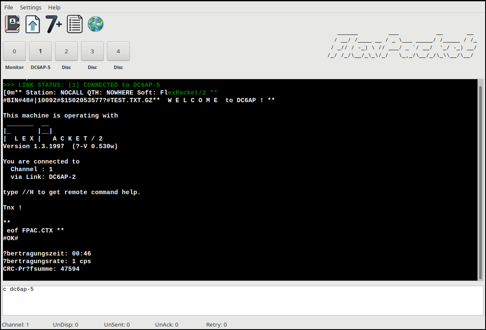
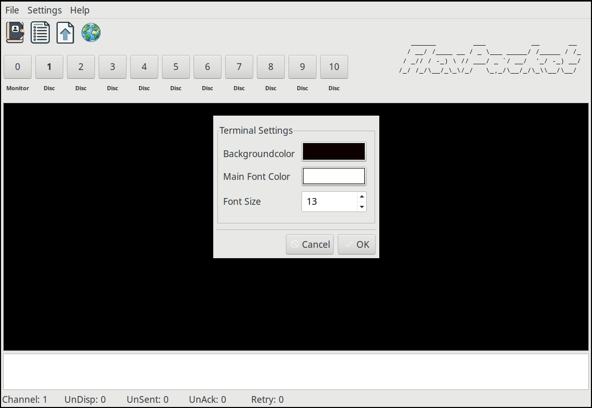

# Flexpacket - Packet Radio Client.

a

## Important Infos

I'm a Linux User! So, the main platform for FlexPacket are Linux based Systems
and not Windows. But I realy do my best to support Windows. Sometimes I nead
your help. As example, I have issues with Hostmode under Windows. But I cannot
find the problem. If someone use Windows on Hardware (not like me in a VM), I
would be happy to get feedback if Hostmode via USB/RS232 is working.

## Features

- Support for Hostmode TNC's (with TF2.x Firmware) 
- Support for KISS via TFKISS (external Software)
- Multichannel (only in Hostmode/TFKISS) 
- Addressbook for quick connections and BayCom password
- 7Plus generator
- Support for the AGW Protocol 
- 7Plus FileUp/Download (only in Hostmode) 
- Common ANSI color codes (in testing)
- APRS Map as external Software.

## Planned Features

- Support forms to send simple structured information in an emergency case. 

## Requirements 

- Windows Users need the [sqlite3.dll](https://www.sqlite.org/download.html).

## How to compile

- Install Lazarus 3.6
- Install TRichMemo, LazSerial

## How to use

### How to connect with a station

In the command and message field (CMF), hit the `<ESC>` key to enter the command mode.
You will get visual feedback via a red line above CMF. Then type
`c <DESTINATION_CALL>` and then hit the Enter/Return key. At the same time,
you will exit the command mode.

### Baycom Password

To use the Baycom password functionality, add your baycom password into the 
Addressbook (be aware that it will be stored in playtext right now). 

If you connect to a BBS with enabled password, you will get a couple of numbers.

Copy it with your mouse, open the Addressbook an hit the key button:

The calculated password string will be in your clipboard for the next 10 seconds.
You can paste it in the CMF field.

### Change the Commad Memo Field (CMF) size

If you want to change the size of the CMF, grab the gab with your Mouse.
The size will be stored in the configuration file.

### How to use KISS Mode

FlexPacket does not support KISS directly. TFKISS must be used for this. 
To use TFKISS, enable and configure it in the menu (Setting). For Linux
you can find TFKISS [here](https://github.com/andreaspeters/tfkiss). 

Before someone ask! No I do not plan to implement KISS into FlexPacket. From
the development perspective KISS and specialy AX25 is very complicated. 
But FlexPacket should not be huge and complicated. I want to keep it as simple 
as possible for other Ham's to read, understand and Maintain the code.

## Shortcuts

- `ALT+0 to 9` Show Monitor or Channel 1 to 9
- `ALT+A` Open Addressbook
- `ALT+C` In the Addressbook, execute QuickCall at the current choosen Callsign
- `ALT+P` In the Addressbook, get the calculated BayCom password string
- `ALT+D` In the Addressbook, delete the current choosen Callsign

## Screenshots

